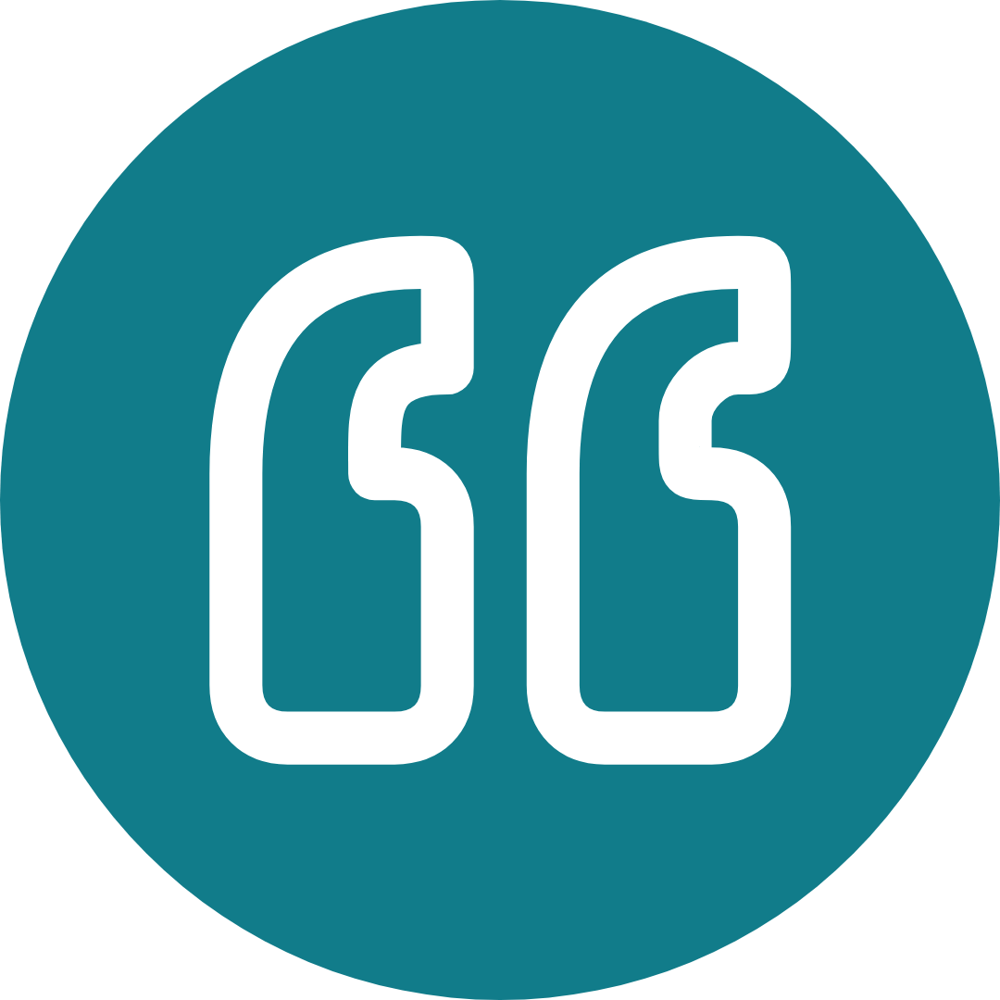
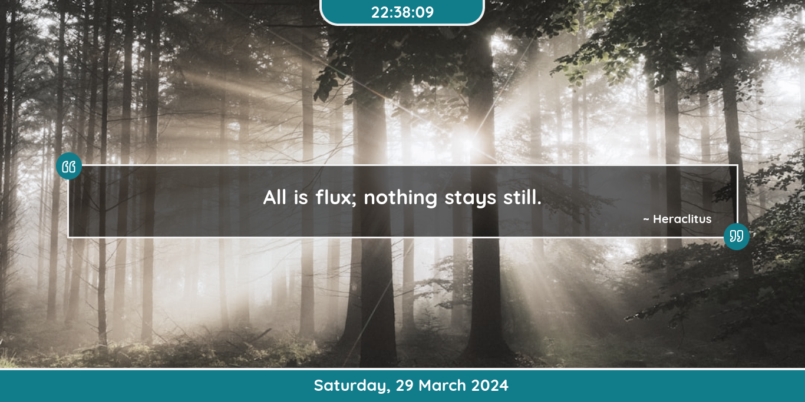
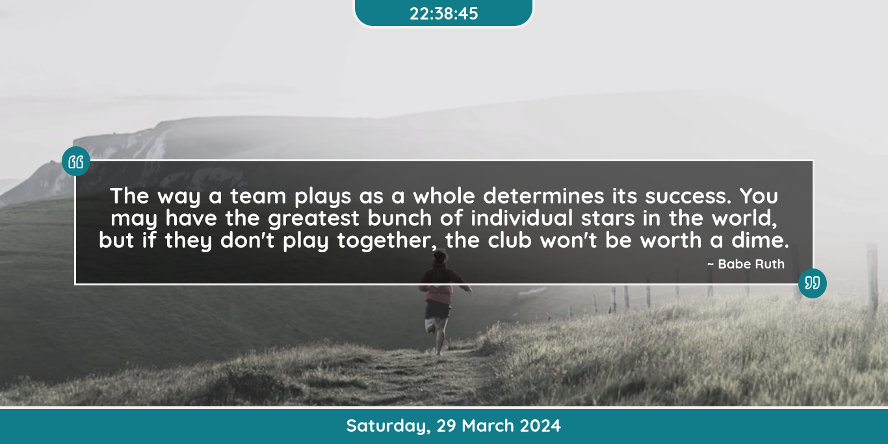

# Kata Browser Homepage

The Kata Browser Homepage is a minimalist start page. created for front end development skills practice

## Features

- **Random Quotes:** Fetches random quotes and authors from the Quotable API.
- **Dynamic Backgrounds:** Retrieves random background images from the Unsplash API.
- **Automatic Updates:** Content updates automatically every 60 seconds.
- **Clock and Date Display:** Includes a clock and date display.

## Technologies Used

- HTML5, CSS3, JavaScript for front-end development.
- Quotable API for fetching random quotes.
- Unsplash API for fetching random background images.
- GitHub Pages for hosting the project.
- Lucide icon for svg icon.

## Screenshoot

## Contributing

Contributions are welcome! If you have any ideas for improvements or new features, feel free to submit a pull request.

## License

This project is licensed under the [MIT License](LICENSE).

## Acknowledgements

- [Quotable API](https://github.com/lukePeavey/quotable)
- [Unsplash API](https://unsplash.com/developers)
- [Lucide](https://lucide.dev/)

